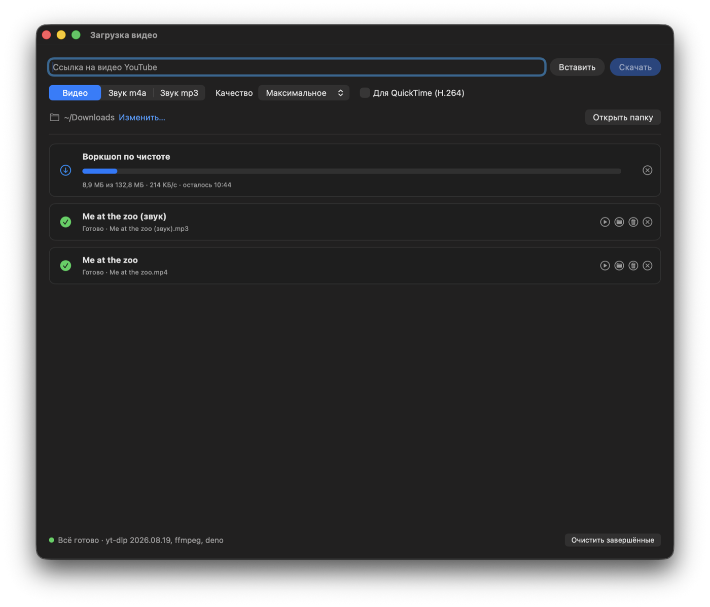
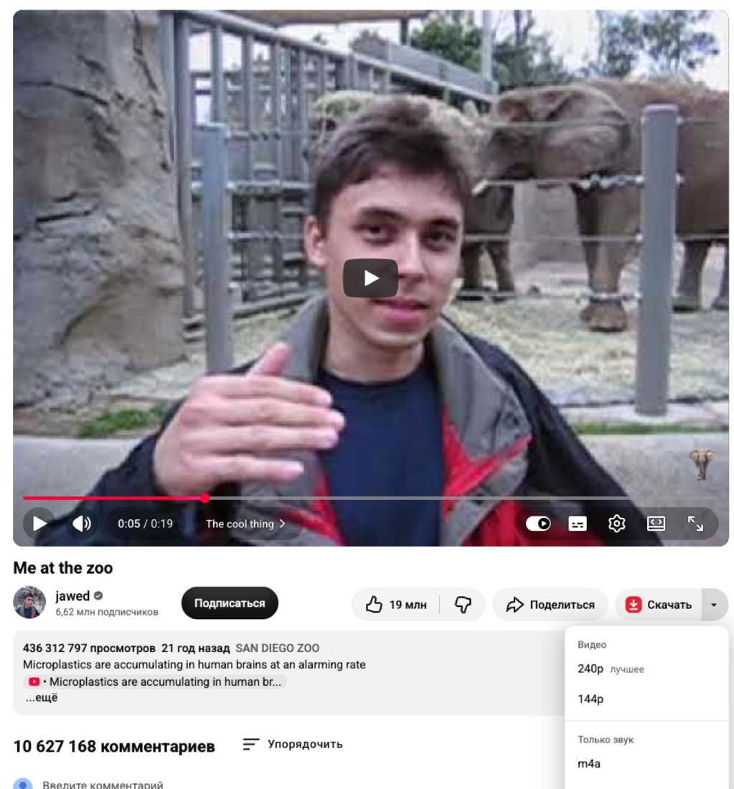
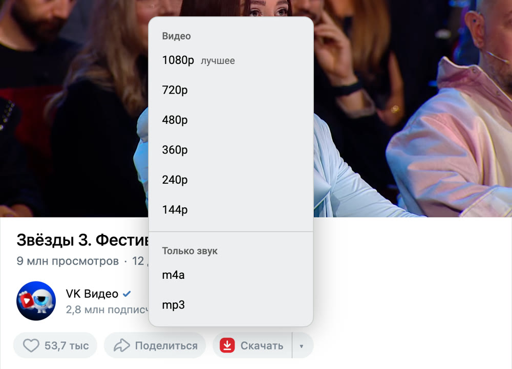
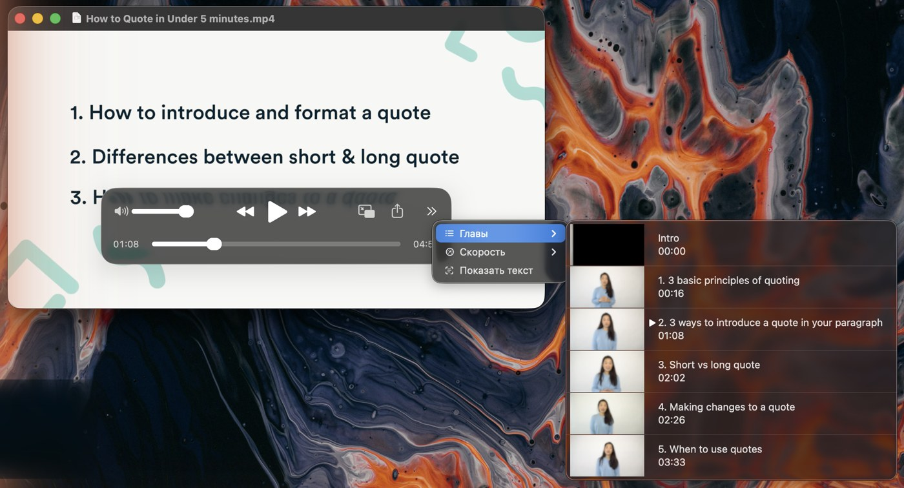
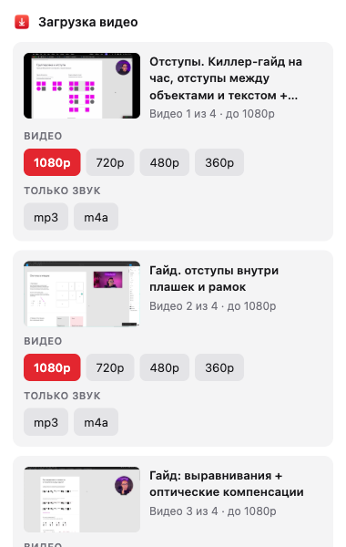

# DownMax

Приложение для macOS, которое скачивает видео, звук, фото, файлы по прямым ссылкам и торренты. К нему прилагается расширение
для Chrome, а при сборке с сертификатом разработчика — и для Safari. Оно добавляет кнопку «Скачать» на YouTube и VK Видео, показывает видео страницы на GetCourse,
Instagram, Threads и Vimeo и отправляет ролик в приложение. Скачивает приложение через yt-dlp
и ffmpeg, а там, где yt-dlp не справляется, забирает файлы напрямую.

DownMax бесплатный. Если он вам пригодился — [поддержать разработку](https://pay.cloudtips.ru/p/f46d5416)
(также пункт «Поддержать DownMax ♥» в меню приложения).

## Как это выглядит

**Приложение.** Ссылки приходят из браузера или вставляются в поле. Видно ход загрузки, готовый
файл можно открыть, показать в Finder или удалить.



**YouTube.** Под видео, перед «⋯», появляется кнопка «Скачать» (своя кнопка YouTube «Скачать»
скрывается): основная часть качает с настройками приложения, ▾ открывает список качеств ролика и звук.



**VK Видео.** Такая же кнопка «Скачать ▾» под роликом на vkvideo.ru и vk.com, у клипов — круглая
кнопка в столбце справа. ▾ показывает качества ролика и звук.



**Главы.** Если у ролика на YouTube есть главы, они сохраняются прямо в файле: в видео и в звуке
m4a и mp3. В QuickTime список глав с превью открывается кнопкой » на панели управления → «Главы»,
по ним можно переходить. IINA и VLC главы тоже показывают.



**Окошко расширения** (по клику на значок). На уроке GetCourse — все видео страницы по порядку,
с превью, заголовком блока и качествами потока. Так же оно работает для Instagram, Threads и Vimeo.



## Откуда качает

| Сайт | Что умеет |
|---|---|
| YouTube | Кнопка «Скачать ▾» под видео со списком качеств ролика, звук m4a и mp3, Shorts, до 4K; главы ролика встраиваются в файл (в QuickTime — » → «Главы») |
| GetCourse | Все плееры урока в порядке страницы, превью, заголовок блока в имени файла, выбор качества из HLS-потока |
| Instagram | Reels и видео в 1080p; карусели и фото — папкой `01.jpg, 02.mp4…`; посты, видимые в ленте, профиле и «Интересном» |
| Threads | Видео поста и остальные ролики со страницы, с превью и пометкой «без звука»; ссылку на пост (и «Поделиться → Копировать ссылку» с телефона) можно вставить прямо в поле приложения |
| Vimeo | Обычные и скрытые ссылки (`vimeo.com/ID/ключ`), выбор качества |
| VK Видео | Кнопка «Скачать ▾» под роликом и у клипов, список качеств, ролики поверх ленты и стены (`?z=video…`); vkvideo.ru, vk.com, vk.ru. Только открытые ролики: yt-dlp заходит в VK без аккаунта |

Любую другую ссылку, которую понимает yt-dlp, можно вставить в поле приложения.

**Файлы по прямым ссылкам** (zip, dmg, pdf, iso…) — вставить ссылку в то же поле. Приложение
само понимает, файл это или страница с видео, и качает файл в 8 потоков; пауза и продолжение
после перезапуска — как у торрентов.

**Торренты.** Magnet-ссылку можно вставить в то же поле или просто кликнуть в браузере,
`.torrent` — открыть двойным щелчком, перетащить в окно или открыть через ⌘O. Перед
загрузкой видно дерево файлов: ненужные можно снять. Загрузку можно поставить на паузу;
при выходе из приложения она останавливается и продолжается при следующем запуске.
Раздача после загрузки по умолчанию выключена (галочка «Раздавать после загрузки» — до
рейтинга 1). Качает aria2c. Участники раздачи видят ваш IP-адрес.

Все видео открываются в QuickTime. Приложение берёт лучшее качество, а если оно есть только
в VP9 или AV1 (4K на YouTube, Instagram), после загрузки перекодирует его в H.264 встроенным
кодировщиком Mac, с сохранением глав. Галочка «Без перекодирования» сразу берёт H.264: готово
быстрее, но качество обычно не выше 1080p.

## Установка

### Готовое приложение

1. Скачать `DownMax-macOS.zip` из последнего релиза:
   [Releases](https://github.com/ohlexlexa/DownMax/releases/latest).
2. Открыть DownMax прямо из «Загрузок» (Safari распаковывает архив сам, в Chrome — двойной щелчок по архиву).
   DownMax спросит «Перенести в «Программы»?» — «Перенести», и он переедет туда сам. Дальше откроется помощник
   настройки: он скачает нужные программы и поможет поставить расширение для браузера.
3. Запустить приложение. В первый раз macOS его заблокирует: оно подписано без сертификата
   разработчика. Открыть «Системные настройки → Конфиденциальность и безопасность» и нажать
   «Всё равно открыть». Или выполнить в Терминале:
   ```bash
   xattr -dr com.apple.quarantine "/Applications/DownMax.app"
   ```
4. Если не хватает yt-dlp, ffmpeg или deno, само откроется окно «Компоненты»: кнопка «Установить»
   скачает их в папку DownMax (около 150 МБ). Homebrew, Терминал и пароль не нужны; если программы
   уже стоят через Homebrew, DownMax берёт их. aria2c для торрентов лежит внутри приложения
   (собран из [исходников aria2](https://github.com/aria2/aria2), GPL 2 — см. `vendor/build-aria2.sh`).
5. В том же окне нажать «Установить» у Chrome, затем включить
   «Режим разработчика» на странице расширений и перетащить на неё папку `chrome-extension`,
   открытую в Finder.
6. Для торрентов в «Компонентах» нажать «Открывать в DownMax» в строке «Торренты» — тогда
   magnet-ссылки и `.torrent` будут открываться в DownMax.

### В строке меню

Если закрыть окно, DownMax продолжает работать: значок пропадает из Дока и остаётся в строке меню.
На нём кольцо общего прогресса и число загрузок; в меню — идущие загрузки, «Открыть DownMax»,
«Скачать ссылку из буфера обмена» и «Завершить DownMax».

### Ссылки с iPhone

В «Компонентах» включить «Ссылки с iPhone» и нажать «Как сделать команду»: на iPhone в «Командах»
собирается команда из двух действий, в неё вставляется адрес Mac («Скопировать адрес» — на iPhone
вставится через общий буфер обмена). Потом в любом приложении: «Поделиться» → DownMax, и ссылка
скачивается на Mac. Без ввода команда берёт ссылку из буфера обмена. Работает в той же сети Wi-Fi,
пока Mac не спит. Готовый файл команды приложение не делает: macOS подписывает команды только
при входе в iCloud.

### Обновление

DownMax раз в день проверяет, нет ли новой версии на GitHub; проверить сразу можно в меню
DownMax → «Проверить обновления…». Если есть, внизу окна появляется «Доступна версия … ·
Обновить»: приложение скачает её, перезапустится, а торренты продолжатся. Предупреждения macOS
при обновлении не будет. Сборка из исходников с расширением для Safari так не обновляется —
см. ниже. Версии до 2.0 (они назывались «Загрузка видео») так обновляться
не умеют — 2.0 нужно один раз скачать вручную.

### Сборка из исходников

Нужны Xcode Command Line Tools (`xcode-select --install`).

1. Скачать проект и собрать приложение. Скрипт сам поставит его в «Программы»:
   ```bash
   git clone https://github.com/ohlexlexa/DownMax.git
   cd DownMax
   ./build.sh
   ```
2. Запустить «DownMax». Предупреждения macOS при этом не будет: приложение собрано
   на этом Mac.
3. Поставить компоненты и расширение, как в шагах 4–5 выше.

### Расширение для Safari

Safari держит расширение включённым, только если оно подписано сертификатом разработчика,
поэтому в готовом приложении из релиза его нет. При сборке из исходников оно появляется само,
если на Mac есть сертификат «Apple Development» — хватает бесплатного аккаунта Apple:
Xcode → Settings → Accounts → войти → Manage Certificates → «+» → Apple Development.
Такая подпись действует только на этом Mac.

1. Собрать приложение (`./build.sh`) и запустить его: Safari найдёт расширение сам.
   Если сертификата нет, скрипт пишет «собираю без расширения для Safari».
2. Внизу окна приложения нажать «Включить» у строки «Расширение для Safari выключено»:
   откроются Safari → Настройки → Расширения. Поставить галочку у «DownMax».
3. Разрешить расширению работать на сайтах (при первом нажатии на значок или
   «Изменить сайты…» в тех же настройках).

Код расширения общий с Chrome (`chrome-extension/`). Сборка с Safari не обновляется из релизов
(в них Safari нет): обновить — `git pull` и `./build.sh`.


Чтобы перенести приложение на другой Mac, достаточно скопировать `DownMax.app`:
расширение уже внутри, а компоненты ставятся из окна «Компоненты».

## Как устроено

```
расширение (страница сайта)  ──downmax://…──►  приложение  ──►  yt-dlp / ffmpeg / прямые загрузки
```

- **Приложение** (`main.swift`, SwiftUI + AppKit). Принимает ссылки `downmax://`,
  запускает yt-dlp, показывает прогресс в окне и на значке в Доке.
- **Ссылки от расширения:**
  - `downmax://download?url=…&mode=video|m4a|mp3&quality=<высота>&title=<имя файла>`
  - `downmax://gallery?title=…&items=[{"u":"<прямая ссылка>","k":"jpg|mp4"}]` — набор файлов (карусель).
- **Расширение** (`chrome-extension/`, Manifest V3) лежит внутри приложения и при запуске
  копируется в `~/Library/Application Support/DownMax/chrome-extension`, откуда его грузит Chrome.
  Для Safari тот же код вшивается в приложение как `Contents/PlugIns/DownMax Safari.appex`:
  - `download-button.js` — общее для кнопок на сайтах: значок, меню качеств, отправка в приложение;
  - `content.js` + `page-bridge.js` — кнопка на YouTube и список качеств из плеера;
  - `vk.js` — кнопка на VK Видео (качества — из встраиваемого плеера через `background.js`);
  - `instagram-bridge.js` — запоминает посты Instagram из фоновых запросов ленты;
  - `background.js` — ловит HLS-потоки GetCourse, качества роликов VK, пункты контекстного меню;
  - `popup.*` — окошко по клику на значок: GetCourse, Instagram, Threads, Vimeo, VK, YouTube.
- **Торренты** (`torrent.swift`). По процессу aria2c на торрент; пауза — остановка процесса,
  продолжение — запуск с теми же параметрами (ход хранится в `<имя>.aria2` рядом с файлами).
  Список торрентов и копии `.torrent` — в `~/Library/Application Support/DownMax`.
- **Обновления** (`updater.swift`). Последний релиз — через API GitHub; архив `DownMax-macOS.zip`
  распаковывается во временную папку, а подменяет приложение после выхода маленький скрипт.
- **Временные файлы** лежат в `~/Library/Caches/DownMax`, в «Загрузки» попадает только
  готовый файл. Загрузку можно поставить на паузу, при выходе она останавливается и продолжается
  при следующем запуске; недокачанное удаляется, когда загрузку отменяют или убирают из списка.
- **Журнал входящих ссылок:** `~/Library/Logs/DownMax.log`.
- **Анонимная статистика.** DownMax отправляет, сколько загрузок удалось и не удалось, с какого сайта
  (из списка поддерживаемых, остальные — «другой»), вид ошибки одним словом, версии DownMax, macOS и yt-dlp,
  и случайный номер установки. Ссылки, названия, имена файлов, пути, текст ошибок и отзывов не отправляются.
  Выключить: меню DownMax → «Отправлять анонимную статистику». Приёмник — `stats/index.py`.

## Файлы

| Файл | Что это |
|---|---|
| `main.swift` | Приложение: окно, видео, компоненты, ссылки от расширений |
| `torrent.swift` | Торренты и файлы по прямым ссылкам: aria2c, окно выбора файлов торрента, строка в списке |
| `build.sh` | Сборка универсального бинарника, иконки, Info.plist, подпись, установка в «Программы» |
| `make_icon.swift` | Рисует иконку 1024×1024 |
| `set_icon.swift` | Ставит «свою» иконку приложению, чтобы macOS не затемняла её в тёмном режиме |
| `menubar.swift` | Значок и меню в строке меню |
| `ui.swift` | Цвет бренда и окно-вопрос по центру |
| `remote.swift` | Приём ссылок с iPhone по домашней сети и общий выбор, кто качает ссылку |
| `updater.swift` | Проверка и установка обновлений из релизов GitHub |
| `errors.swift` | Понятные тексты ошибок yt-dlp, aria2c и сети |
| `stats.swift` | Анонимная статистика: очередь событий и отправка |
| `stats/` | Приёмник статистики — функция Yandex Cloud, пишет в YDB |
| `chrome-extension/` | Расширение для Chrome и Safari |
| `safari/` | Обязательный обработчик расширения Safari (сам код расширения — в `chrome-extension/`) |

## Требования

macOS 14+, Apple Silicon или Intel. Для сборки — Xcode Command Line Tools (`swiftc`).

Скачивайте только то, на что у вас есть права: свои курсы, материалы с разрешённым
сохранением, видео для личного просмотра.
